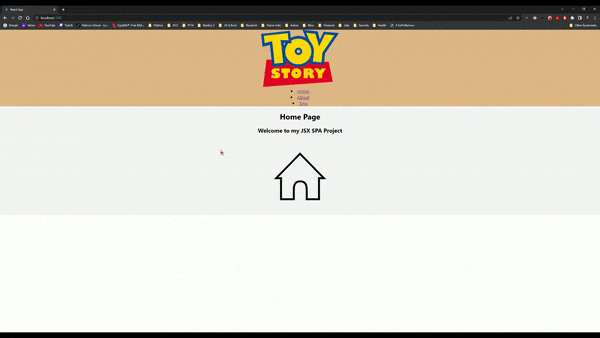

# Phase 2 Project

This project will put together all I know about JSX and further build on my JS skills.

 

## Overview
-------------
This is what the homepage looks like:

 

This project utilizes the useState and useEffect hooks, as well as client-side routing.

## Usage
-------------
As a user I can:

- Navigate between three routes
- View all available toys
- Add a new toy to the list

## License
-------------
[MIT](https://choosealicense.com/licenses/mit/)